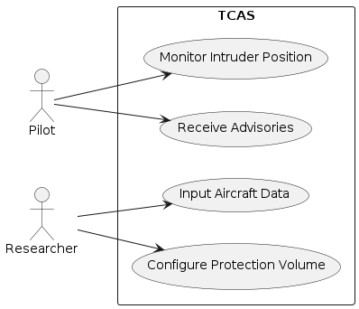

# TCAS (Traffic Collision Avoidance System) Simulation

[](https://www.mathworks.com/products/matlab.html)
[]()

## 📋 Table of Contents
- [Overview](#overview)
- [Features](#features)
- [Hazard Analysis](#hazard-analysis)
- [Installation](#installation)
- [Usage](#usage)
- [Simulation Scenarios](#simulation-scenarios)
- [Technical Specifications](#technical-specifications)
- [Demo](#demo)
- [Diagrams](#diagrams)
- [Final Report](#final-report)
- [Documentation](#documentation)

## 🎯 Overview

This project implements a comprehensive **Traffic Collision Avoidance System (TCAS)** simulation in MATLAB, designed for aviation safety research and educational purposes. TCAS is a critical safety system that helps prevent mid-air collisions by providing pilots with traffic advisories and resolution advisories.

The simulation includes:
- **Real-time aircraft tracking and threat detection**
- **FAA-compliant TCAS thresholds and logic**
- **Multiple collision scenarios** (head-on, overtaking, etc.)
- **Interactive 2D visualization** with radar display
- **Comprehensive hazard analysis** using industry-standard methodologies

## ✨ Features

### Core TCAS Functionality
- **Identify and Track**: Aircraft detection within 20km range
- **Threat Detection**: Real-time calculation of Time to Closest Point of Approach (TAU) and closing velocity
- **Advisory Logic**: Traffic Advisory (TA) and Resolution Advisory (RA) generation
- **Resolution Logic**: Parity-based conflict resolution (even climbs, odd descends)

### Visualization
- **2D Aircraft Plot**: Real-time flight path visualization with advisory status
- **Pilot Radar Display**: Cockpit-style radar interface with color-coded alerts
- **Dynamic Background**: Visual indicators for different advisory levels
- **Real-time Data Display**: Range, TAU, closing velocity, and threshold information

### Simulation Capabilities
- **Multiple Scenarios**: Head-on collision, overtaking, same/different parity
- **Configurable Parameters**: Aircraft IDs, velocities, initial positions
- **FAA Compliance**: Based on official TCAS thresholds and procedures
- **Real-time Animation**: Smooth 60-second simulation with 0.1s time steps

## 🔍 Hazard Analysis

This project includes comprehensive hazard analysis using industry-standard methodologies:

### FMEA (Failure Mode and Effects Analysis)
- **System-level failure modes** identification
- **Component reliability analysis**
- **Failure effects assessment** on aircraft safety
- **Risk priority number (RPN)** calculations

### STPA (System-Theoretic Process Analysis)
- **Control structure analysis** of TCAS system
- **Unsafe control actions** identification
- **Loss scenarios** development
- **Causal factor analysis**

### STPA-Sec (STPA for Security)
- **Security threat modeling** for TCAS systems
- **Cyber-physical attack scenarios**
- **Vulnerability assessment** of communication protocols
- **Security control recommendations**

*Note: Detailed hazard analysis documentation and diagrams are available in the project documentation folder.*

## 🚀 Installation

### Prerequisites
- **MATLAB R2020b or later**

### Setup Instructions
1. **Clone the repository**:
   ```bash
   git clone https://github.com/muzammilmalik01/tcas-system.git
   cd tcas-simulation
   ```

2. **Open MATLAB** and navigate to the project directory

3. **Run the main simulation**:
   ```matlab
   main_simulation
   ```

## 📖 Usage

### Basic Usage
```matlab
% Run the main simulation with default settings
main_simulation

```

### Scenario Selection
The simulation includes multiple pre-configured scenarios. To change scenarios, uncomment the desired scenario in the code:

```matlab
% Head-on collision scenario (different parity)
ac1_x0 = 0;         ac1_y0 = 36000;     ac1_vx = 120;   ac1_vy = 0;   ac1_id = 1234;
ac2_x0 = 15000;     ac2_y0 = 36000;     ac2_vx = -120;  ac2_vy = 0;   ac2_id = 5679;

% Overtaking scenario (same ID)
ac1_x0 = 0;         ac1_y0 = 36000;     ac1_vx = 250;   ac1_vy = 0;   ac1_id = 1234;
ac2_x0 = 8500;      ac2_y0 = 36000;     ac2_vx = 100;   ac2_vy = 0;   ac2_id = 1234;
```

### Custom Parameters
Modify TCAS thresholds and simulation parameters:

```matlab
% TCAS Thresholds (FAA compliant)
TAU_TA = 48;        % Traffic Advisory threshold (seconds)
DMOD_TA = 2407;     % Traffic Advisory distance (meters)
TAU_RA = 35;        % Resolution Advisory threshold (seconds)
DMOD_RA = 2037;     % Resolution Advisory distance (meters)

% Simulation parameters
dt = 0.1;           % Time step (seconds)
t_sim = 60;         % Total simulation time (seconds)
```

## 🛩️ Simulation Scenarios

### 1. Head-on Collision Scenarios
- **Different Parity**: Even aircraft climbs, odd aircraft descends
- **Same Parity**: Direction-based resolution logic
- **Same ID**: Tests system behavior with identical aircraft IDs

### 2. Overtaking Scenarios
- **Speed-based Resolution**: Faster aircraft climbs, slower descends
- **Parity-based Logic**: Even/odd ID resolution when speeds are similar

### 3. Edge Cases
- **Same Aircraft ID**: System behavior with identical identifiers
- **Zero Closing Velocity**: Non-converging trajectories
- **Boundary Conditions**: Threshold testing scenarios

## 🔧 Technical Specifications

### TCAS Thresholds (FAA Compliant)
| Parameter | Value | Description |
|-----------|-------|-------------|
| TAU_TA | 48 seconds | Traffic Advisory time threshold |
| DMOD_TA | 2407 meters | Traffic Advisory distance threshold |
| TAU_RA | 35 seconds | Resolution Advisory time threshold |
| DMOD_RA | 2037 meters | Resolution Advisory distance threshold |

### Aircraft Parameters
- **Altitude Range**: 34,000 - 38,000 feet
- **Speed Range**: 100 - 250 m/s
- **Tracking Range**: 20 km maximum
- **Resolution Delay**: 1.5 seconds after RA issuance

### Resolution Logic
1. **Parity Check**: Even aircraft IDs climb, odd descend
2. **Direction Analysis**: Positive velocity climbs, negative descends
3. **Speed Comparison**: Faster aircraft climbs, slower descends
4. **Fallback**: No action if same speed and direction

## 🖼️ Demo

### Simulation Screenshots
- **No Conflict**:

- **Traffic Advisory Triggered**:

- **Resolution Advisory Triggered**:


*Note: Demo screenshots are available in the `Images/` folder.*

## 📊 Diagrams
- **Use Case Diagram**:
  

- **Sequence Diagrams**:
  

- **Activtity Diagram**:
  


*Note: All diagrams are available in high resolution in the `Images/` folder.*

## 📄 Final Report

### Comprehensive System Report  
The final report provides a detailed overview of the **TCAS II digital twin**, developed in MATLAB based on **FAA guidelines** and the logic of **TCAS II Version 7.1**.

#### Summary  
- Simulates mid-air conflict between two aircraft on the same flight level using predefined data.  
- Issues **Traffic Advisory (TA)** or **Resolution Advisory (RA)** using deterministic logic.  
- Visual radar interface mimics real-world TCAS radar for intuitive pilot feedback.  
- Development followed **V-Model XT** principles with partial integration of safety standards from **IEC 61508**.

---

### 📊 Key Sections  

#### ✅ **Project Overview**
- **Objective**: Simulate a simplified TCAS II system to detect and respond to collision threats.  
- **Scope**: Horizontal 2D simulation of two aircraft (head-on or overtaking).  
- **Implementation**: MATLAB-based logic with real-time radar visualization.

#### ⚙️ **System Design & Logic**
- **Components**: Identify & Track → Threat Evaluation → Advisory Selection → Radar  
- **Algorithms**: Calculates Range, TAU, and closing speed; generates advisories based on thresholds.  
- **UI**: Radar-style HMI with color-coded TA/RA alerts and real-time simulation.

#### 🔐 **Safety & Security Analysis**
- **FMEA**: Identified high-risk failure modes (e.g., missing input data, advisory logic errors).  
- **STPA**: Mapped software control actions to hazards and derived software-level safety constraints.  
- **STPA-Sec**: Identified cybersecurity vulnerabilities (e.g., remote access risks, source code tampering).

#### 🧪 **Risk & Reliability**
- Simulated critical edge cases and tested logic accuracy.  
- Incorporated **Safety Requirements, Constraints, and Mitigation Measures**.  

#### 📷 **Prototype**
- Screenshots of TA and RA simulation states, radar display, and alert mechanisms.  
- Real-time tracking, advisory generation, and aircraft trajectory display.

---

### 📚 Report Structure

- **Abstract**  
- **System Architecture & Algorithms**  
- **Hazard Analysis (FMEA, STPA, STPA-Sec)**  
- **Safety & Security Requirements**  
- **UML & Activity Diagrams**  
- **Radar HMI Description**  
- **Appendices**: Calculations, constraints, extra diagrams  
- **References**: FAA & ICAO documentation on TCAS II  

📄 The complete report is available in [`Final_Report_TCAS_Simulation.pdf`](./Documentation/TCAS-Final-Report.pdf)

## 📚 Documentation

### Available Documentation
- **Final Report**: TCAS Development Details [`Final_Report_TCAS_Simulation.pdf`](./Documentation/TCAS-Final-Report.pdf)
- **Hazard Analysis Reports**: FMEA, STPA, and STPA-Sec detailed analysis [`Hazard_Analysis.pdf`](./Documentation/TCAS-Hazard-Analysis.pdf)
- **FAA Guidelines**: Official FAA guidelines for TCAS v7.1 System [`FAA_Guidelines.pdf`](./Documentation/TCAS-FAA-Guideline-1.pdf)
---

